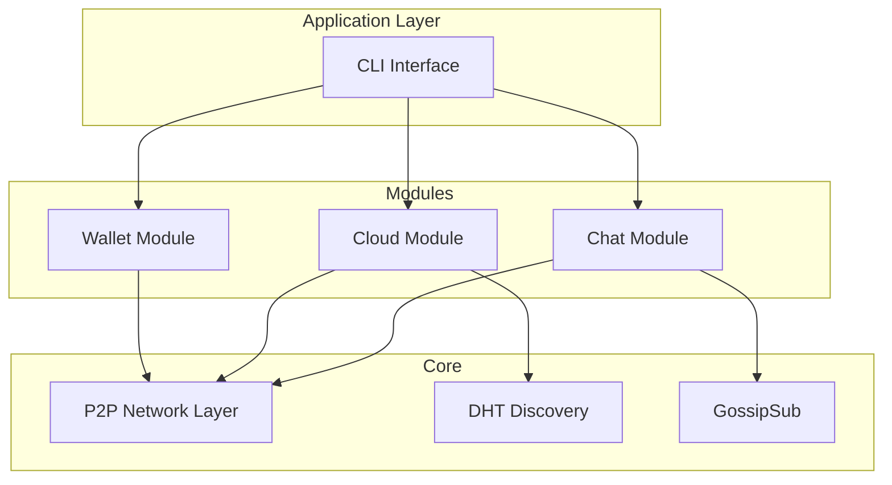

# Decentralized P2P Chat & Cloud Application

Build a decentralized chat and cloud file storage application using **go-libp2p** with modular architecture.

## Architecture Overview



## Project Structure

```
p2papp/
├── go.mod
├── go.sum
├── cmd/
│   └── p2papp/
│       └── main.go              # CLI entry point
├── internal/
│   ├── core/
│   │   ├── host.go              # libp2p host setup
│   │   └── config.go            # Application config
│   ├── wallet/
│   │   ├── wallet.go            # Wallet service
│   │   ├── identity.go          # Peer identity management
│   │   └── keystore.go          # Key storage
│   ├── chat/
│   │   ├── service.go           # Chat service
│   │   ├── pubsub.go            # GossipSub messaging
│   │   ├── room.go              # Room/channel management
│   │   └── dm.go                # Direct messaging
│   └── cloud/
│       ├── service.go           # Cloud service
│       ├── storage.go           # File storage
│       ├── transfer.go          # P2P file transfer
│       └── index.go             # DHT file indexing
└── pkg/
    └── protocol/
        ├── chat.go              # Chat protocol definitions
        └── cloud.go             # Cloud protocol definitions
```

---

## Modules

### Core Module

| File | Description |
|------|-------------|
| `host.go` | Initialize libp2p host with TCP/QUIC, peer discovery (mDNS, DHT), NAT traversal |
| `config.go` | Application configuration loading and defaults |

### Wallet Module

```go
type WalletService interface {
    Create() (*Wallet, error)
    Load(path string) (*Wallet, error)
    Save(w *Wallet, path string) error
    GetPeerID() peer.ID
}
```

| File | Description |
|------|-------------|
| `wallet.go` | Wallet service implementation |
| `identity.go` | Ed25519 keypair generation, peer ID derivation |
| `keystore.go` | Encrypted key storage with AES-GCM + PBKDF2 |

### Chat Module

```go
type ChatService interface {
    JoinRoom(roomID string) error
    LeaveRoom(roomID string) error
    SendMessage(roomID, content string) error
    SendDM(peerID peer.ID, content string) error
    Subscribe() <-chan Message
}
```

| File | Description |
|------|-------------|
| `service.go` | Chat service orchestration |
| `pubsub.go` | GossipSub topic management |
| `room.go` | Room creation, discovery, member tracking |
| `dm.go` | Direct P2P streams for private messages |

### Cloud Module

```go
type CloudService interface {
    Upload(filePath string) (FileHash, error)
    Download(hash FileHash, destPath string) error
    List() ([]FileInfo, error)
    Share(hash FileHash, peerID peer.ID) error
}
```

| File | Description |
|------|-------------|
| `service.go` | Cloud service orchestration |
| `storage.go` | File chunking (256KB), content-addressed storage |
| `transfer.go` | P2P file transfer protocol with verification |
| `index.go` | DHT-based file indexing and provider discovery |

---

## CLI Commands

```bash
# Wallet
p2papp wallet create          # Create new wallet
p2papp wallet show            # Show peer ID

# Chat
p2papp chat join <room>       # Join chat room

# Cloud
p2papp cloud upload <file>    # Upload file
p2papp cloud download <hash>  # Download file
p2papp cloud list             # List files

# Interactive
p2papp run                    # Run interactive P2P node
```

---

## Verification

### Unit Tests
```bash
go test ./...
go test ./internal/wallet/... -v
go test ./internal/chat/... -v
go test ./internal/cloud/... -v
```

### Integration Tests
1. Two peers exchange messages via chat room
2. Peer A uploads file, Peer B downloads via hash
3. Direct message between peers

### Manual Testing
1. `./p2papp wallet create` → verify key file created
2. Open 2 terminals, join same room, send messages
3. Upload file from peer 1, download from peer 2, verify checksum
